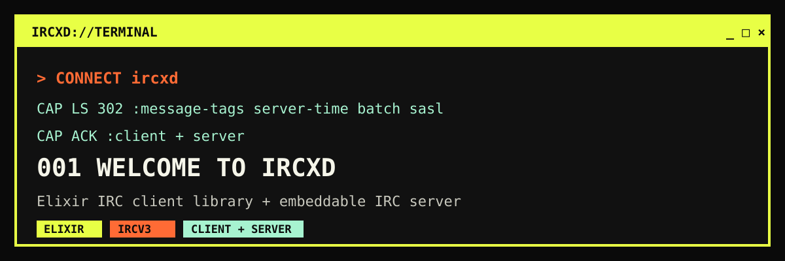

# ircxd



`ircxd` is an IRC client library and embeddable IRC server for Elixir. Use it
to build bots, bridges, notification services, Phoenix integrations, or an IRC
interface backed by your application's own accounts and data.

```text
YOUR APP <-> Ircxd.Client <-> IRC NETWORK
IRC CLIENT <-> Ircxd.Server <-> YOUR ADAPTER
```

## Features

- **Client and server in one library** — connect to existing networks or embed
  an isolated IRC server in an OTP supervision tree.
- **Modern IRCv3 support** — capability negotiation, message tags, server-time,
  message IDs, batches, labeled responses, multiline messages, chat history,
  account tracking, and more.
- **Secure connections and authentication** — verified implicit TLS plus SASL
  `PLAIN`, `EXTERNAL`, and `SCRAM-SHA-256` client support.
- **Application-owned policy** — adapters control authentication,
  authorization, persistence, custom commands, and committed-event handling.
- **Elixir-friendly integration** — focused command helpers, structured
  messages, process notifications, callback adapters, and reconnect support.
- **Useful protocol building blocks** — CTCP, DCC payloads, WebIRC, WebSocket,
  formatting, casemapping, ISUPPORT, standard replies, and wire-size validation.

## Installation

Add `ircxd` to your Mix dependencies:

```elixir
def deps do
  [
    {:ircxd, "~> 1.0"}
  ]
end
```

Then fetch dependencies:

```bash
mix deps.get
```

## Quickstart

Start a client process and receive events in the calling process:

```elixir
{:ok, client} =
  Ircxd.start_link(
    host: "irc.libera.chat",
    port: 6697,
    tls: true,
    sni: "irc.libera.chat",
    nick: "myapp",
    username: "myapp",
    realname: "My App",
    caps: ["server-time", "echo-message"],
    notify: self()
  )

receive do
  {:ircxd, :registered} -> :ok
end

:ok = Ircxd.Client.join(client, "#elixir")
:ok = Ircxd.Client.privmsg(client, "#elixir", "hello from ircxd")
```

TLS clients verify the server certificate chain and hostname by default using
the operating-system CA store. A custom trust root can be supplied with
`tls_options: [cacertfile: "/path/to/ca.pem"]`. Disabling verification with
`verify: :verify_none` should be limited to isolated development fixtures.

## Supported IRC commands

The client table below lists commands with dedicated `Ircxd.Client` helpers or
automatic client handling.
`Ircxd.Client.raw/3`, `Ircxd.Client.raw_tagged/4`, and
`Ircxd.Client.transmit/2` can send other commands supported by a remote network.

### Client commands

| Area | Commands |
| --- | --- |
| Connection and capabilities | `CAP`, `PASS`, `NICK`, `QUIT`, `WEBIRC`; automatic `USER`, `PING`, and `PONG` |
| Channels | `JOIN`, `PART`, `NAMES`, `LIST`, `INVITE`, `KICK`, `TOPIC`, `MODE`, `RENAME` |
| Messaging | `PRIVMSG`, `NOTICE`, `TAGMSG`, `BATCH`, `REDACT` |
| Presence and identity | `AWAY`, `SETNAME`, `MONITOR`, `METADATA`, `MARKREAD` |
| User and server queries | `WHO`, `WHOIS`, `WHOWAS`, `USERHOST`, `ISON`, `MOTD`, `LUSERS`, `VERSION`, `TIME`, `ADMIN`, `INFO`, `HELP`, `STATS`, `LINKS`, `ISUPPORT` |
| Accounts and history | `AUTHENTICATE` through SASL, `REGISTER`, `VERIFY`, `CHATHISTORY` |
| Operator, service, and legacy | `OPER`, `KILL`, `WALLOPS`, `SQUERY`, `TRACE`, `CONNECT`, `SQUIT`, `REHASH`, `RESTART`, `SUMMON`, `USERS`, `SERVLIST` |

Higher-level helpers cover replies, typing notifications, reactions, channel
context, multiline messages, read markers, metadata subscriptions, capability
lifecycle, and all six supported `CHATHISTORY` queries.

### Server commands

| Area | Commands |
| --- | --- |
| Registration and connection | `CAP`, `AUTHENTICATE` (`PLAIN` and `EXTERNAL`), `PASS`, `NICK`, `USER`, `PING`, `PONG`, `QUIT` |
| Channels | `JOIN`, `PART`, `NAMES`, `LIST`, `INVITE`, `KICK`, `TOPIC`, `MODE` |
| Messaging | `PRIVMSG`, `NOTICE`, `TAGMSG`, `BATCH`, `REDACT` |
| Presence and identity | `AWAY`, `SETNAME`, `MONITOR` |
| User and server queries | `WHO`, `WHOIS`, `WHOWAS`, `USERHOST`, `ISON`, `MOTD`, `LUSERS`, `VERSION`, `TIME`, `ADMIN`, `INFO`, `HELP`, `STATS`, `LINKS` |
| History | `CHATHISTORY` (`LATEST`, `BEFORE`, `AFTER`, `AROUND`, `BETWEEN`, and `TARGETS`) |

The embedded server also negotiates the IRCv3 capabilities that back these
commands. Applications can add adapter-defined commands through the adapter's
`handle_command/3` callback; unknown commands receive the standard numeric or
IRCv3 `FAIL` response.

## Embedded IRC Server

Applications can start one or more independent IRC servers in their own
supervision tree. Give each server child a distinct `:id`:

```elixir
children = [
  {Ircxd.Server, id: :public_irc, port: 6667, server_name: "public.example"},
  {Ircxd.Server, id: :internal_irc, port: 6668, server_name: "internal.example"}
]

Supervisor.start_link(children, strategy: :one_for_one)
```

The server accepts one `adapter: {Module, init_arg}` for application-owned
state, committed-event projections, policy, custom commands, and SASL
credential checks. The included ETS adapter is useful in tests and is also a
supported production choice when node-local, memory-only storage is suitable:

```elixir
{Ircxd.Server,
 id: :public_irc,
 port: 6667,
 adapter: {Ircxd.Server.Adapters.ETS, history_limit: 1_000}}
```

Applications inspect and change adapter-owned state without impersonating an
IRC client:

```elixir
{:ok, users} = Ircxd.Server.query(server, :users)
{:ok, channels} = Ircxd.Server.query(server, :channels)

{:ok, _channel} =
  Ircxd.Server.execute(server, {
    :put_channel,
    "#elixir",
    %{description: "Elixir discussion"}
  })
```

See the [server adapter guide](docs/server-adapters.md) for the full adapter
contract, ETS lifecycle, queries, operations, events, authorization,
authentication, and custom-command examples.

Listeners bind to localhost (`{127, 0, 0, 1}`) by default. Set `ip: {0, 0, 0,
0}` to expose a server on all IPv4 interfaces, or provide another IPv4 bind
address per server.

Adapters implement `Ircxd.Server.Adapter`. Committed events, queries,
operations, policy checks, custom commands, and legacy message publication are
serialized. Authentication has a separate serialized state lane and runs in a
bounded task so a credential lookup cannot block protocol traffic. For
example, a custom adapter may project committed messages into its database:

```elixir
defmodule MyApp.IrcAdapter do
  @behaviour Ircxd.Server.Adapter

  @impl true
  def init(db), do: {:ok, db}

  @impl true
  def handle_event(%Ircxd.Server.Event{type: :message_accepted} = event, context, db) do
    MyApp.Messages.persist(db, event, context)
    {:ok, db}
  end
end

{Ircxd.Server,
 id: :public_irc,
 port: 6667,
 adapter: {MyApp.IrcAdapter, MyApp.Repo}}
```

Adapter callback exceptions are contained by the worker. Applications remain
responsible for durable transaction semantics, retry policy, and keeping
credential material out of events and logs.

Server information can be configured with `motd: ["Welcome"]`,
`info: ["Ircxd.Server"]`, and `isupport: ["CHANTYPES=#&", "NICKLEN=30"]`.
Help text uses `help: %{"JOIN" => ["JOIN <channel>"]}`. Administrative
details use `admin: %{location: ["Operations"], email: "admin@example.test"}`.
Network protection defaults to 1,024 simultaneous connections, 100 commands
per connection per second, 128 concurrent TLS handshakes, and a five-second TLS
handshake timeout. These can be changed with `max_connections`,
`command_rate_limit`, `max_handshakes`, and `handshake_timeout`.

Authentication callbacks run in a supervised, serialized worker with a
five-second timeout. Configure this per server with
`authentication_timeout`; application configuration under
`config :ircxd, Ircxd.Server, ...` supplies defaults when per-server options
are not provided.

For an implicit TLS listener, set `tls: true` and provide standard Erlang SSL
options such as `certfile` and `keyfile` through `tls_options`:

```elixir
{Ircxd.Server,
 id: :secure_irc,
 port: 6697,
 tls: true,
 tls_options: [certfile: "/path/to/server.crt", keyfile: "/path/to/server.key"]}
```

SASL EXTERNAL is disabled by default. Enabling it requires a TLS listener that
verifies client certificates:

```elixir
{Ircxd.Server,
 port: 6697,
 tls: true,
 external_auth: true,
 adapter: {MyApp.IrcAdapter, MyApp.Repo},
 tls_options: [
   certfile: "/path/to/server.crt",
   keyfile: "/path/to/server.key",
   verify: :verify_peer,
   cacertfile: "/path/to/client-ca.crt"
 ]}
```

The authenticator metadata includes `:mechanism`, `:peer`, `:transport`,
`:peer_certificate`, and `:peer_certificate_sha256`. Applications must map or
authorize the submitted EXTERNAL identity against that verified certificate.

Use `Ircxd.Client.Adapter` when an outbound client connection should deliver
events to application code:

```elixir
defmodule MyApp.IrcClientAdapter do
  @behaviour Ircxd.Client.Adapter

  @impl true
  def init(application_state), do: {:ok, application_state}

  @impl true
  def handle_event(:registered, context, state) do
    MyApp.ConnectionLog.registered(context)
    {:ok, state}
  end

  def handle_event({:message, message}, context, state) do
    MyApp.Messages.store_incoming(message, context)
    {:ok, state}
  end
end

Ircxd.start_link(
  host: "irc.example.test",
  nick: "my-app",
  adapter: {MyApp.IrcClientAdapter, MyApp.Repo}
)
```

The client and server use the uniform modules `Ircxd.Client.Adapter` and
`Ircxd.Server.Adapter`, both configured through `adapter: {Module, init_arg}`.
See the [client adapter guide](docs/client-adapters.md) and
[server adapter guide](docs/server-adapters.md) for their distinct event
sources and callback contracts. The old `Ircxd.Handler` and `:handler` option
remain supported for client compatibility.

## Application Boundaries

The embedded server owns live protocol state needed to operate each connection.
Its adapter owns application projections and policies. The ETS adapter can
retain a channel catalog, account ACLs, live session/membership projections,
and bounded accepted-message history until its server process or node stops.
Durable accounts, cross-node recovery, UI policy, and notifications remain
application responsibilities.

WebSocket server lifecycle is also host-owned. `Ircxd.WebSocket` validates the
IRCv3 WebSocket subprotocol and one-line payload rules, and host applications
can provide adapters implementing `Ircxd.WebSocket.Adapter` for Phoenix
Channels, Cowboy, Bandit, or another stack.

Detailed server boundary guidance is available in the
[server adapter guide](docs/server-adapters.md).

## Testing

Set up the locally generated TLS fixtures once after checking out the
repository. This requires `openssl`:

```bash
bin/setup-tests
```

Run the default automated suite:

```bash
mix test
```

Run the suite with the project coverage floor:

```bash
mix cover
```

Run repeatable microbenchmarks for the protocol hot paths:

```bash
mix bench
```

The benchmark command uses only the Erlang/Elixir runtime and reports median
and p95 sample time plus operations per second. Compare results on the same
machine and runtime; it is intended for detecting relative regressions rather
than publishing cross-machine absolute numbers.

Run the full standard verification gate:

```bash
scripts/run_verification_gates.sh
```

Include the optional irssi cross-client check:

```bash
IRCXD_INCLUDE_IRSSI=1 scripts/run_verification_gates.sh
```

The integration tests expect a local InspIRCd on `127.0.0.1:6667`. Additional
opt-in scripts create disposable local fixtures for services-backed IRCv3 and
real standard-replies coverage:

```bash
scripts/run_services_integration.sh
scripts/run_standard_replies_integration.sh
scripts/run_irssi_manual_check.sh
scripts/run_irssi_server_check.sh
```

## Documentation

- [Client adapters](docs/client-adapters.md): outbound client event delivery
  and callback contract.
- [Server adapters](docs/server-adapters.md): embedded server state, policy,
  authentication, custom commands, and event contract.
- [Security](docs/security.md): security model, review findings, and remediation
  priorities.

## Development

Development expects Elixir 1.19, Erlang/OTP, InspIRCd on `127.0.0.1:6667`,
and optional `atheme-services`, `irssi`, `tmux`, and `sudo` for the opt-in
integration checks.

Run `bin/setup-tests` once after checkout to generate the TLS fixtures used by
the TLS integration tests.

```bash
mix deps.get
mix format --check-formatted
mix compile --warnings-as-errors
mix test
mix docs
mix hex.build --unpack
```

Use `scripts/run_verification_gates.sh` when the local IRC services are
available and you want the same gate used before release-oriented commits.

## License

Copyright 2026 Akash Manohar John.

Licensed under the Apache License, Version 2.0. See `LICENSE`.
