# ircxd - IRC client & server library for Elixir

> Use it to build your bots, or embed an IRC server on your app - backed by your application's own accounts and data.



## Features

- Connect to IRC networks
- Run an IRC server in your Elixir app
- **Modern IRCv3 support** — capability negotiation, message tags, server-time,
  message IDs, batches, labeled responses, multiline messages, chat history,
  account tracking, and more.
- **Secure connections and authentication** — Verified implicit TLS plus SASL
  `PLAIN`, `EXTERNAL`, and `SCRAM-SHA-256` client support.
- **Application-owned policy** — adapters control authentication,
  authorization, persistence, custom commands, and committed-event handling.
- **Useful protocol building blocks** — CTCP, DCC payloads, WebIRC, WebSocket,
  formatting, casemapping, ISUPPORT, standard replies, and wire-size validation.

## Installation

Add `ircxd` to your Mix dependencies:

```elixir
def deps do
  [
    {:ircxd, "~> 1.0"}
  ]
end
```

Then fetch dependencies:

```bash
mix deps.get
```

## Quickstart

> Depending on whether you want to build a client or server, point your agent at the client adapter or server adapter documentation links mentioned below in the documentation section.

Start a client process and receive events in the calling process:

```elixir
{:ok, client} =
  Ircxd.start_link(
    host: "irc.libera.chat",
    port: 6697,
    tls: true,
    sni: "irc.libera.chat",
    nick: "myapp",
    username: "myapp",
    realname: "My App",
    caps: ["server-time", "echo-message"],
    notify: self()
  )

receive do
  {:ircxd, :registered} -> :ok
end

:ok = Ircxd.Client.join(client, "#elixir")
:ok = Ircxd.Client.privmsg(client, "#elixir", "hello from ircxd")
:ok = Ircxd.Client.action(client, "#elixir", "waves")
```

TLS clients verify the server certificate chain and hostname by default using
the operating-system CA store. A custom trust root can be supplied with
`tls_options: [cacertfile: "/path/to/ca.pem"]`. Disabling verification with
`verify: :verify_none` should be limited to isolated development fixtures.

## Supported IRC commands

The client table below lists commands with dedicated `Ircxd.Client` helpers or
automatic client handling.
`Ircxd.Client.raw/3`, `Ircxd.Client.raw_tagged/4`, and
`Ircxd.Client.transmit/2` can send other commands supported by a remote network.

### Client commands

| Area | Commands |
| --- | --- |
| Connection and capabilities | `CAP`, `PASS`, `NICK`, `QUIT`, `WEBIRC`; automatic `USER`, `PING`, and `PONG` |
| Channels | `JOIN`, `PART`, `NAMES`, `LIST`, `INVITE`, `KICK`, `TOPIC`, `MODE`, `RENAME` |
| Messaging | `PRIVMSG`, `NOTICE`, `TAGMSG`, `BATCH`, `REDACT` |
| Presence and identity | `AWAY`, `SETNAME`, `MONITOR`, `METADATA`, `MARKREAD` |
| User and server queries | `WHO`, `WHOIS`, `WHOWAS`, `USERHOST`, `ISON`, `MOTD`, `LUSERS`, `VERSION`, `TIME`, `ADMIN`, `INFO`, `HELP`, `STATS`, `LINKS`, `ISUPPORT` |
| Accounts and history | `AUTHENTICATE` through SASL, `REGISTER`, `VERIFY`, `CHATHISTORY` |
| Operator, service, and legacy | `OPER`, `KILL`, `WALLOPS`, `SQUERY`, `TRACE`, `CONNECT`, `SQUIT`, `REHASH`, `RESTART`, `SUMMON`, `USERS`, `SERVLIST` |

Higher-level helpers cover replies, typing notifications, reactions, channel
context, multiline messages, read markers, metadata subscriptions, capability
lifecycle, and all six supported `CHATHISTORY` queries.

### Server commands

| Area | Commands |
| --- | --- |
| Registration and connection | `CAP`, `AUTHENTICATE` (`PLAIN` and `EXTERNAL`), `PASS`, `NICK`, `USER`, `PING`, `PONG`, `QUIT` |
| Channels | `JOIN`, `PART`, `NAMES`, `LIST`, `INVITE`, `KICK`, `TOPIC`, `MODE` |
| Messaging | `PRIVMSG`, `NOTICE`, `TAGMSG`, `BATCH`, `REDACT` |
| Presence and identity | `AWAY`, `SETNAME`, `MONITOR` |
| User and server queries | `WHO`, `WHOIS`, `WHOWAS`, `USERHOST`, `ISON`, `MOTD`, `LUSERS`, `VERSION`, `TIME`, `ADMIN`, `INFO`, `HELP`, `STATS`, `LINKS` |
| History | `CHATHISTORY` (`LATEST`, `BEFORE`, `AFTER`, `AROUND`, `BETWEEN`, and `TARGETS`) |

The embedded server also negotiates the IRCv3 capabilities that back these
commands. Applications can add adapter-defined commands through the adapter's
`handle_command/3` callback; unknown commands receive the standard numeric or
IRCv3 `FAIL` response.

## Embedded IRC Server

Add `Ircxd.Server` to an OTP supervision tree:

```elixir
children = [
  {Ircxd.Server,
   id: :public_irc,
   port: 6667,
   server_name: "irc.example.test",
   adapter: {Ircxd.Server.Adapters.ETS, history_limit: 1_000}}
]

Supervisor.start_link(children, strategy: :one_for_one)
```

The included ETS adapter provides node-local, memory-only accounts, channels,
policy, and bounded history. Applications can query or change adapter-owned
state directly:

```elixir
{:ok, users} = Ircxd.Server.query(server, :users)
{:ok, channel} = Ircxd.Server.execute(server, {:put_channel, "#elixir", %{}})
```

Listeners bind to localhost by default. Use `ip: {0, 0, 0, 0}` to expose the
listener, or enable implicit TLS with `tls: true` and standard Erlang
`tls_options`.

## Adapters

Both sides accept `adapter: {Module, init_arg}`. Use `Ircxd.Client.Adapter` for
outbound client events and `Ircxd.Server.Adapter` for application-owned server
state, persistence, authentication, authorization, and custom commands.

See [Client usage and adapters](docs/client-adapters.md) for the complete client
lifecycle and client callback contract. The [server adapter
guide](docs/server-adapters.md) covers server state, security boundaries, and
production integration.

## Documentation

- [Client usage and adapters](docs/client-adapters.md): connection setup,
  supervision, events, commands, capabilities, authentication, reconnection,
  and the client callback contract.
- [Server adapters](docs/server-adapters.md): embedded server state, policy,
  authentication, custom commands, and event contract.
- [Development and testing](docs/development.md): local setup, automated tests,
  benchmarks, integration checks, and release verification.
- [Security](docs/security.md): security model, review findings, and remediation
  priorities.

## License

Copyright 2026 Akash Manohar John

Licensed under the Apache License, Version 2.0 (the "License");
you may not use this file except in compliance with the License.
You may obtain a copy of the License at

    http://www.apache.org/licenses/LICENSE-2.0

Unless required by applicable law or agreed to in writing, software
distributed under the License is distributed on an "AS IS" BASIS,
WITHOUT WARRANTIES OR CONDITIONS OF ANY KIND, either express or implied.
See the License for the specific language governing permissions and
limitations under the License.
